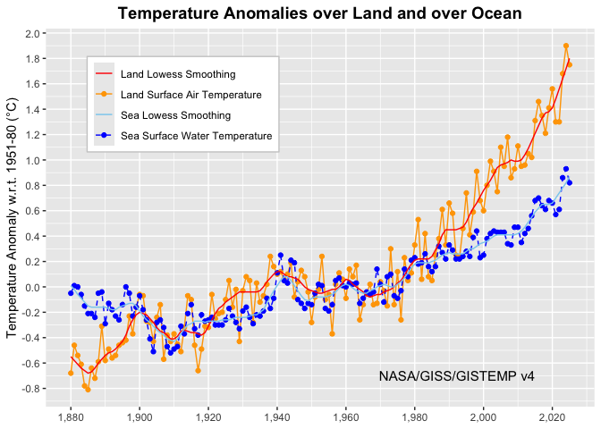
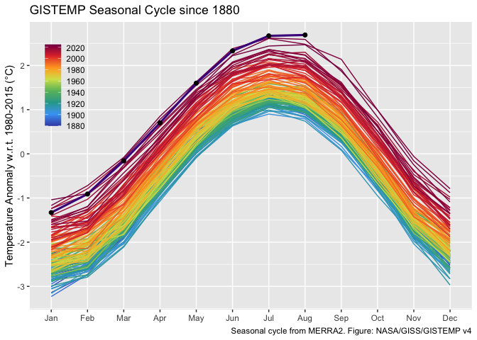
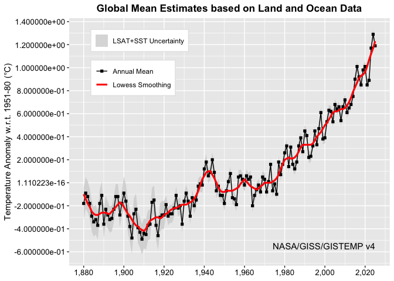
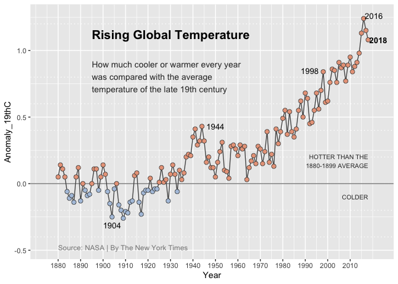

# Project 1 Report
Esteban Lopez
2026-10-01

# Summary

The purpose of this data project is to replicate four different
visualizations made via NASA’s GISS Surface Temperature Analysis. By
completing this replication project, the following is demonstrated:
reproducible data workflows, data visualization, and clean project
sharing with Github.

## Graphic 1

This graphic depicts temperature anomolies throughout the decades and
based on different regions, with a clear difference from temperatures
long ago. This highlights how global temperatures have been increasing
consistently overall, with a sharp increase in temperatures starting
from the 1980s.

## Graphic 2

This graphic shows the seasonal cycles of temperatures from January to
December. It’s apparent from the visualizations that the overall highest
annual temperatures have increased throughout time, with the highest
temperatures being recorded in July and August.

## Graphic 3

This graphic depicts global mean temperature anomolies throughout time.
It demonstrates that there has been a steady increase in the global mean
temperatues as compared to previous decades.

## Graphic 4

This direct graphical replication of the NY Times visualizations shows
just how far the global temperature has gone since the average from the
late 1800s. The blue data points in the plot depict temperatures cooler
than late 19th century average, while the orange depict temperatures
warmer than the baseline average. As you can see, temperatres have gone
far past the averages from the late 1800s, and only seem to be
increasing overall.
